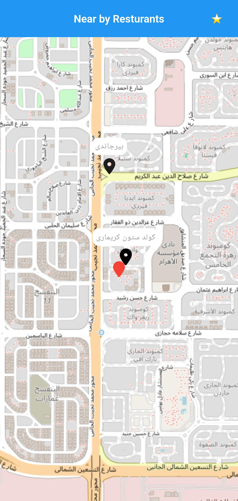
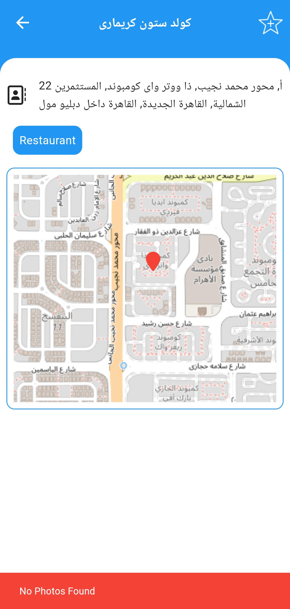

# Restaurant Finder App

A Flutter application that displays nearby restaurants.

List the key features and functionalities of your project:
- fetching nearby resturants and displaying them on map.

- viewing details for each restaurant.

- ability to favorite the restaurant and save in a secure storage.

## Packages Used

- [flutter_map](https://pub.dev/packages/flutter_map)
- [latlong2](https://pub.dev/packages/latlong2)
- [http](https://pub.dev/packages/http)
- [flutter_secure_storage](https://pub.dev/packages/flutter_secure_storage)
- [permission_handler](https://pub.dev/packages/permission_handler)
- [geolocator](https://pub.dev/packages/geolocator)
- [Provider](https://pub.dev/packages/provider)
- [carousel_slider](https://pub.dev/packages/carousel_slider)
- [connectivity_plus](https://pub.dev/packages/connectivity_plus)
- [font_awesome_flutter](https://pub.dev/packages/font_awesome_flutter)

### System Architecture (MVVM)

    lib/
    ├── core/
    │   ├── common
    │   ├── constants
    │   ├── data/
    │   │   ├── api
    │   │   ├── models
    │   │   ├── repos
    │   │   └── storage
    │   ├── extentions
    │   ├── theme
    │   └── utils 
    ├── features/
    │   ├── details/
    │   │   ├── data
    │   │   ├── view
    │   │   └── view_model
    │   ├── favorites/
    │   │   ├── data
    │   │   ├── view
    │   │   └── view_model
    │   └── search/
    │       ├── data
    │       ├── view
    │       └── view_model
    ├── app.dart
    └── main.dart

#### Setup Instructions
1. Clone the repository.
2. Open the terminal and navigate to the project directory.
3. Run `flutter pub get` to install the dependencies.
4. Run `flutter devices` to check if your device is connected.
5. Run `flutter run` to start the application.

